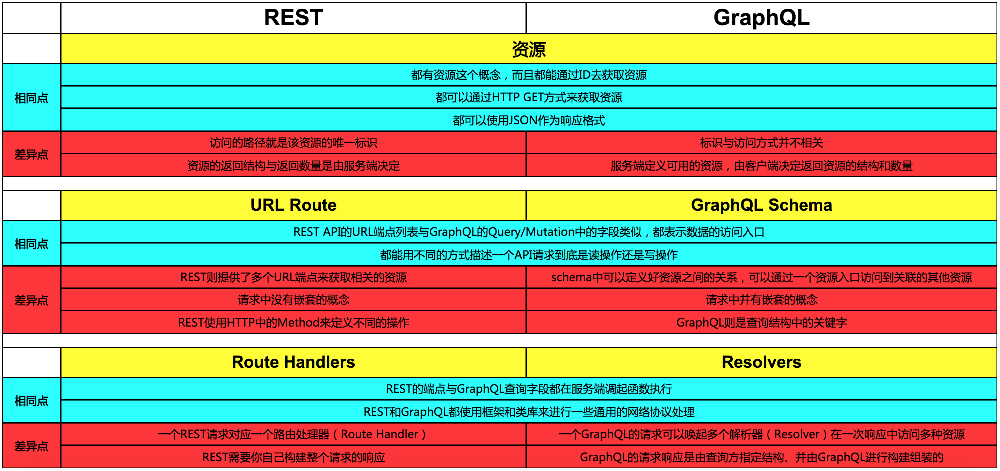

### REST与GraphQL的对比

我们集中关注一下二者之间的差异点：

1. **资源**

    i. REST的路径与资源1:1对应；而GraphQL的标识与访问方式无关(也可以认为Query/Mutation的字段与资源对应)

    ii. REST中由服务端决定返回数据的结构和数量；而GraphQL由客户端指定

2. **路由**

    i. REST需要访问多个URL来获取相关的资源；而对于GraphQL，如果schema中定义好了资源之间的关系，则可以通过一个入口访问相关的资源

    ii. REST请求中没有嵌套的概念；而GraphQL的查询语句中可以嵌套的查询相关资源的字段

    iii. REST使用HTTP协议中的Method来定义不同的操作；而GraphQL则使用查询中的关键字来定义

3. **Handler**

    i. 请求与Handler是1:1对应的；而GraphQL查询则可能(且往往)要使用多个解析器来处理资源的访问

    ii. 请求的响应需要服务端进行构建；而GraphQL的响应结构是由请求方指定，GraphQL来进行构建组装

### REST与GraphQL优缺点分析

1. **REST**

    i. **优点**：可以使用Cache来提高响应速度；无状态提高服务端可扩展性；使用浏览器作客户端；使用HTTP，不依赖其他软件；兼容性好；不需要额外的资源发现机制

    ii. **缺点**：动词(Method)太少；返回码表意不够明确；不支持服务端发起通知；API兼容需要使用版本号

2. **GraphQL**

    i. **优点**：减少字段冗余；不需要额外编写文档；前后端解耦；强类型，可以对出入参进行校验；不受版本号限制；语言支持好(*存疑*)

    ii. **缺点**：无法使用现有的缓存方案；改造成本过大；性能瓶颈

### [开发者社区API分类统计](http://opvpyjlsy.bkt.clouddn.com/charts.html)

由上述分析可知，GraphQL对于请求方来说，最大优势莫过于简化原本复杂的返回数据类型，而在其他场景下，则显得优势不足。通过对华为开发者社区的API进行分类统计可以发现，涉及复杂返回数据类型的API大致集中在企业云通信、物联网、云计算和大数据中，这四类API占比**61.62%**，但是经过实际考察，目前这几类API中并没有一个返回数据结构特别复杂的。

所以，从目前的情况来看，GraphQL优势并不能最大地发挥出来。对于目前开发者社区集成的API来说，GraphQL并不比REST更有优势，也没有解决REST在动词不足、返回码表意不明确和不支持服务端发起通知方面的缺点。但是随着我们的API网关集成越来越多的API，GraphQL的优势场景必然会出现，所以在网关引入GraphQL技术也存在其必然性。